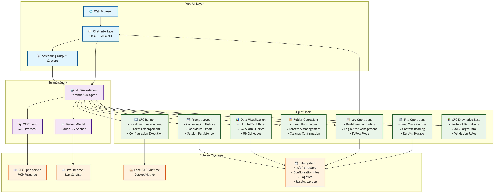

# SFC Wizard Architecture Diagram

## Architecture Components Breakdown

### 🌐 **Web UI Layer**
- **Browser**: User's web browser interface
- **Chat Interface**: Flask + SocketIO web server providing real-time chat
- **Streaming Output Capture**: Captures and streams stdout/stderr in real-time

### 🤖 **Strands Agent**
- **SFCWizardAgent**: Main AI agent class built with Strands SDK
- **BedrockModel**: Claude 3.7 Sonnet LLM integration for natural language processing
- **MCPClient**: Model Context Protocol client for external knowledge access

### 🛠️ **Agent Tools**
1. **File Operations**: Configuration and file management
2. **SFC Runner**: Local test environment execution
3. **Log Operations**: Real-time log monitoring and tailing
4. **Folder Operations**: Directory cleanup and management
5. **Data Visualization**: Real-time data plotting from FILE-TARGET
6. **Prompt Logger**: Conversation history and export
7. **SFC Knowledge**: Built-in protocol and AWS target knowledge

### 🔌 **External Systems**
- **SFC Spec Server**: MCP server providing SFC specification knowledge
- **AWS Bedrock**: Cloud-based LLM service
- **Local SFC Runtime**: Docker or native SFC execution environment
- **File System**: Local storage for configurations, logs, and results

## Key Features

### 🔄 **Real-time Communication**
- WebSocket-based streaming responses
- Live log tailing and monitoring
- Interrupt capability during long responses

### 💾 **Session Management**
- Persistent conversations (60-minute expiry)
- Automatic session restoration
- Cross-browser session continuity

### 🏭 **SFC Integration**
- Local test environment setup
- Configuration validation and execution
- Real-time data visualization
- Multi-protocol support (OPCUA, MODBUS, S7, MQTT, HTTP)

### ☁️ **AWS Integration**
- Bedrock model integration
- Credential validation
- Multiple AWS target support (S3, IoT Core, Timestream)

### 🛡️ **Safety & Reliability**
- Graceful error handling
- Process cleanup on shutdown
- Cross-platform compatibility
- Async task management

## Data Flow

1. **User Input**: Browser → Chat UI → SFC Agent
2. **AI Processing**: Agent → Bedrock Model → AWS Bedrock
3. **Tool Execution**: Agent → Internal Tools → File System/External Systems
4. **Knowledge Access**: Agent → MCP Client → SFC Spec Server
5. **Response Streaming**: Agent → Stream Capture → Chat UI → Browser
6. **Real-time Updates**: Log Operations → Chat UI → Browser (for live monitoring)

This architecture enables a seamless chat-based interface for industrial data connectivity management, combining AI assistance with practical SFC configuration tools.
