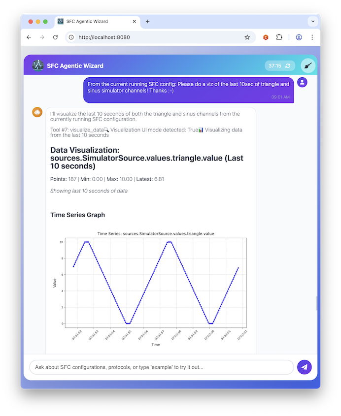
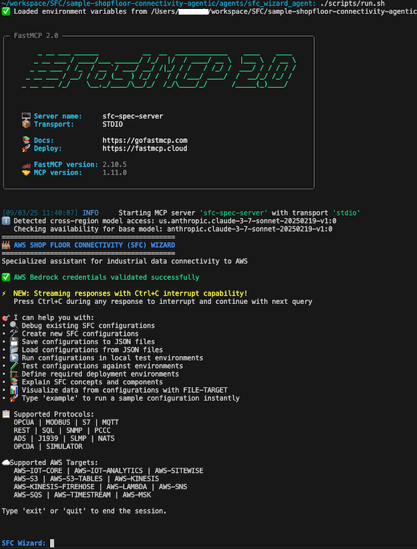

Shop Floor Connectivity - Agentic
================================

AI-powered assistant for [AWS provided Shop Floor Connectivity (SFC)](https://github.com/aws-samples/shopfloor-connectivity) configuration management and testing. Using python [Strands Agents SDK](https://strandsagents.com/latest/documentation/docs/api-reference/agent/) and [FastMCP](https://gofastmcp.com/getting-started/welcome). **All code** in that example was created using Cline and [Kiro app](https://kiro.dev/).

### The Agent in it's own words

> **Q:** What can one do with this assistant?

>**A:** _I help you create, validate, and run Shop Floor Connectivity (SFC) configurations for industrial data collection. I can generate templates, access documentation, visualize data, and monitor systems—making it easier to connect factory equipment to cloud services._


| UI  | CLI |
|-----|-----|
|  |  |

## Quick Start

**Install UV package manager:**
```bash
curl -LsSf https://astral.sh/uv/install.sh | sh
```

**Run SFC Wizard Agent (CLI):**
```bash
uvx --from git+https://github.com/aws-samples/sample-shopfloor-connectivity-agentic.git#subdirectory=agents/sfc_wizard_agent agent
```

**Run SFC Wizard Agent (UI):**
```bash
uvx --from git+https://github.com/aws-samples/sample-shopfloor-connectivity-agentic.git#subdirectory=agents/sfc_wizard_agent sfc-wizard-ui
```


## Architecture

```sh

AGENTIC LOOP FLOW (Strands Agent)
================================

1. User Input ──────────▶ SFCWizardAgent
                             │
2. Intent Analysis ──────────▼
   (via Bedrock LLM)     Tool Selection & Reasoning
                             │
3. Tool Execution ───────────▼
                         ┌─────────┬─────────┐
                         │ Internal│   MCP   │
                         │  Tools  │ Server  │
                         └─────────┴─────────┘
                             │
4. Response Generation ──────▼
   (via Bedrock LLM)     Formatted Response
                             │
5. User Output ──────────────▼
   (CLI/UI Interface)    Human-Readable Result
```

## Platform Support

Currently tested on **macOS** and **Linux**. Windows support not yet verified.

## Links

- [Shopfloor Connectivity Framework](https://github.com/aws-samples/shopfloor-connectivity)
- [Strands Agents SDK](https://github.com/strands-agents/sdk-python)

## License

MIT-0 License. See [LICENSE](LICENSE) file.
